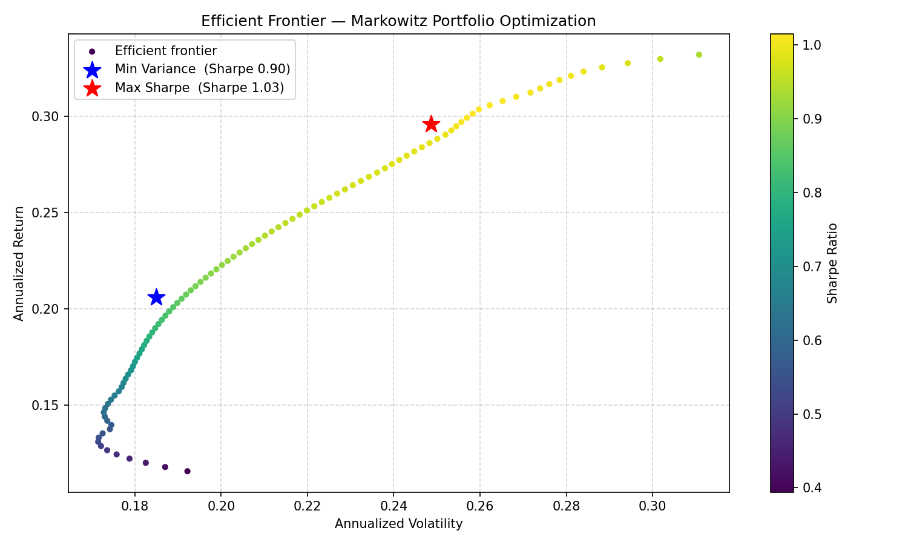

# Markowitz Portfolio Optimizer

A Python implementation of Harry Markowitz's Modern Portfolio Theory (1952).
Given a set of assets and historical price data, this tool computes the
**efficient frontier**, the **minimum variance portfolio**, and the
**maximum Sharpe ratio portfolio** — with full visualizations.

---

## Results

| Portfolio | Return | Volatility | Sharpe |
|-----------|--------|------------|--------|
| Minimum Variance | 17.90% | 19.11% | 0.73 |
| Maximum Sharpe   | 29.60% | 24.87% | 1.03 |



---

## Mathematical Background

### Portfolio Return and Variance

Given $n$ assets with weight vector $w \in \mathbb{R}^n$ (where $\sum_i w_i = 1$),
expected return vector $\mu$, and covariance matrix $\Sigma$:

$$r_p = w^\top \mu$$

$$\sigma_p^2 = w^\top \Sigma w$$

### The Efficient Frontier

The efficient frontier is the set of portfolios that minimize variance for
each level of expected return. For a target return $r^*$, this is a
quadratic programming problem:

$$\min_w \; w^\top \Sigma w$$

$$\text{subject to} \quad w^\top \mu = r^*, \quad \sum_i w_i = 1, \quad w_i \geq 0$$

The constraint $w_i \geq 0$ rules out short selling.

### Minimum Variance Portfolio

The global minimum variance portfolio solves the same problem without
a return constraint — it is the leftmost point of the efficient frontier:

$$\min_w \; w^\top \Sigma w \quad \text{subject to} \quad \sum_i w_i = 1, \quad w_i \geq 0$$

### Maximum Sharpe Ratio Portfolio

The Sharpe ratio measures risk-adjusted return:

$$S = \frac{r_p - r_f}{\sigma_p}$$

where $r_f$ is the risk-free rate. The maximum Sharpe portfolio (also called
the **tangency portfolio**) is found by minimizing $-S$ subject to the
budget constraint.

### Optimization

All problems are solved with `scipy.optimize.minimize` using the
**SLSQP** method (Sequential Least Squares Programming), which handles
quadratic objectives with equality and inequality constraints efficiently.
To avoid local minima, the minimum variance portfolio is solved from
20 random starting points.

---

## Project Structure
```
portfolio_optimizer/
├── data/
│   └── fetcher.py          # Downloads and cleans price data via yfinance
├── optimizer/
│   └── markowitz.py        # Efficient frontier, min variance, max Sharpe
├── visualization/
│   └── plotter.py          # Efficient frontier and weight charts
├── outputs/                # Generated charts and results.txt
├── main.py                 # Entry point
└── requirements.txt
```

## Installation
```bash
git clone https://github.com/rodrisantana/portfolio-optimizer.git
cd portfolio-optimizer
pip install -r requirements.txt
```

## Usage

Edit the configuration at the top of `main.py`:
```python
TICKERS = ["AAPL", "MSFT", "JPM", "JNJ", "XOM", "AMZN", "GOOGL", "BRK-B"]
START_DATE = "2019-01-01"
END_DATE   = "2026-01-01"
RISK_FREE_RATE = 0.04
```

Then run:
```bash
python main.py
```

Results and charts are saved to `outputs/`.

## Dependencies

- `yfinance` — historical price data
- `numpy` / `pandas` — numerical computing and data manipulation
- `scipy` — quadratic optimization (SLSQP)
- `matplotlib` — visualization

## References

- Markowitz, H. (1952). *Portfolio Selection*. The Journal of Finance, 7(1), 77–91.
- Sharpe, W. F. (1966). *Mutual Fund Performance*. The Journal of Business, 39(1), 119–138.
